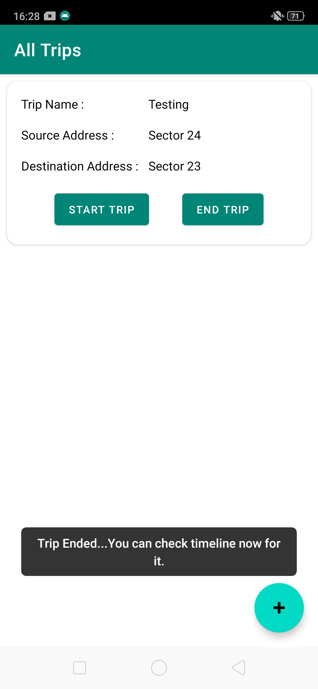
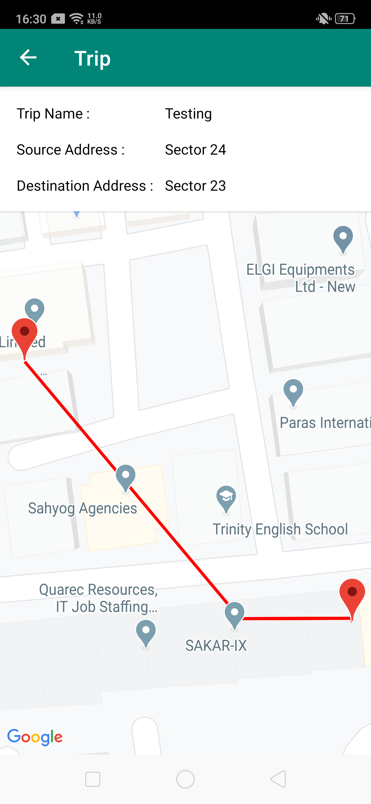

# Trip App
Demo application for store data in local for selected trip in Kotlin

It includes below material components

1. MVVM Architecture

2. Navigation Component

3. Room Database

4. Data Binding

5. Kotlin Coroutines

6. Material Components

# App Images

For more images you can check images folder.

